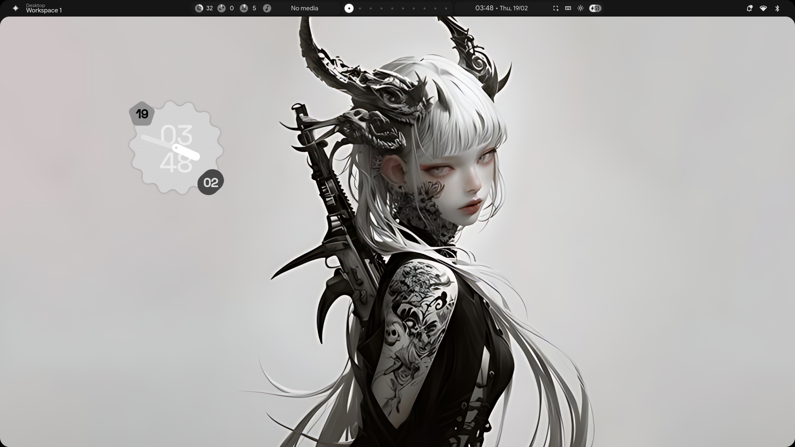
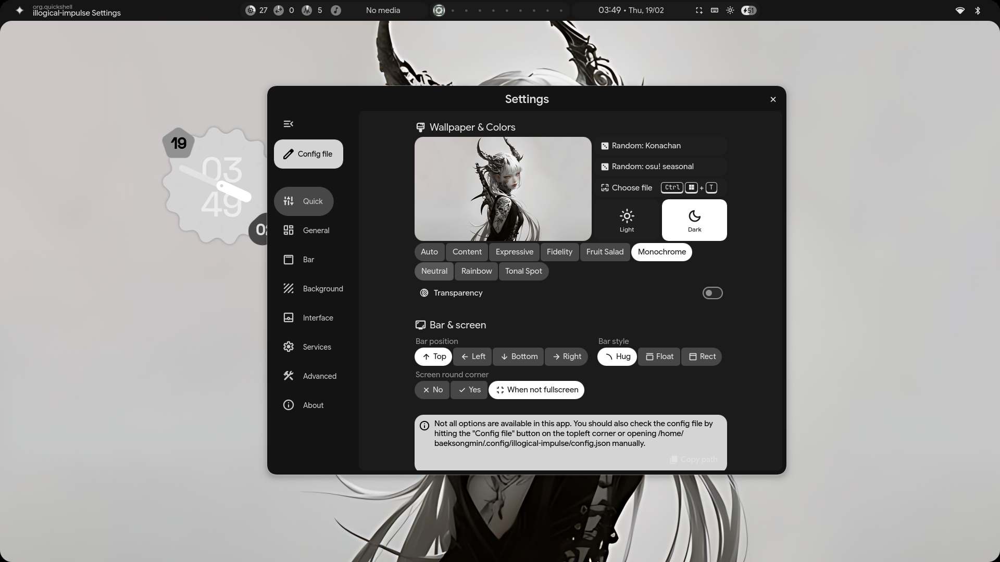
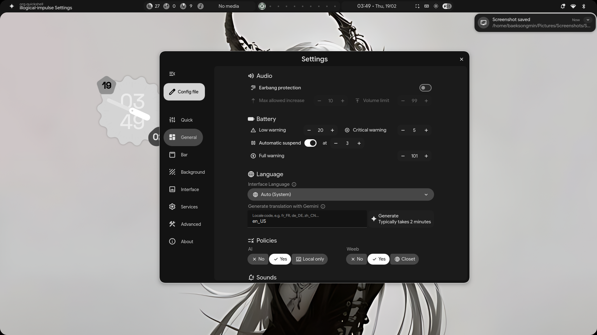

k# 🖥️ Arch Linux Hyprland Dotfiles

Minimal, clean, and modern **Arch Linux + Hyprland** setup with curated configs and theme integration.

> ⚠️ This repository contains **dotfiles/configurations**, not a full Arch installer.
> Make sure you already have a working Arch Linux + Hyprland environment.

---

## ✨ Features

* Hyprland configuration (layouts, keybinds, animations)
* Launcher setup (Fuzzel)
* Terminal configuration (Kitty & Foot)
* Shell prompt (Starship)
* Theme integration (Kvantum + Matugen)
* Logout menu (wlogout)
* Portable asset-based wallpaper setup
* Backup-safe install script with symlink support

---

## 🖼️ Screenshots

<p align="center">
  
</p>

<p align="center">
  
  
</p>

> Add your screenshots inside the `assets/` folder.

---

## 📦 Requirements

Install dependencies before using these dotfiles:

### Core

* hyprland
* xdg-desktop-portal-hyprland

### UI / Tools

* fuzzel
* kitty or foot
* starship
* kvantum
* matugen
* wlogout

### Screenshots

* grim
* slurp
* wl-clipboard

---

## 🚀 Installation

```bash
git clone https://github.com/arataaXwonyoung/arch-hyprland-dotfiles.git
cd arch-hyprland-dotfiles
chmod +x install.sh
./install.sh
```

---

## 🔧 What the install script does

* Creates backup of existing configs
* Symlinks dotfiles into `~/.config`
* Prevents destructive overwrites
* Allows easy updates by pulling repo changes

Backup location:

```
~/.config-backup-*
```

---

## ⌨️ Keybindings (important)

> Update based on your hyprland config

* SUPER + Enter → Terminal
* SUPER + D → Launcher
* Print → Screenshot

---

## 📁 Repository Structure

```
hypr/      → ~/.config/hypr/
kitty/     → ~/.config/kitty/
foot/      → ~/.config/foot/
fuzzel/    → ~/.config/fuzzel/
fish/      → ~/.config/fish/
Kvantum/   → ~/.config/Kvantum/
wlogout/   → ~/.config/wlogout/
matugen/   → ~/.config/matugen/
starship.toml → ~/.config/starship.toml
```

---

## 🎨 Wallpaper

Wallpaper is included in:

```
hypr/assets/wallpaper.png
```

Replace the file to change wallpaper while keeping path intact.

---

## 🔤 Fonts

Install recommended fonts for best appearance:

* JetBrains Mono Nerd Font
* Noto Fonts
* Font Awesome (optional)

---

## 🧯 Troubleshooting

### Hyprland portal issues

Ensure:

```
xdg-desktop-portal-hyprland
```

is installed and running.

### Broken UI or theme

Clear cache:

```
rm -rf ~/.cache/*
```

### Restore previous config

Restore from backup folder created by install script.

---

## 🙏 Credits

* Hyprland → https://github.com/hyprwm/Hyprland
* Fuzzel → https://codeberg.org/dnkl/fuzzel
* Starship → https://starship.rs
* Kvantum → https://github.com/tsujan/Kvantum

---

## 📄 License

MIT License

